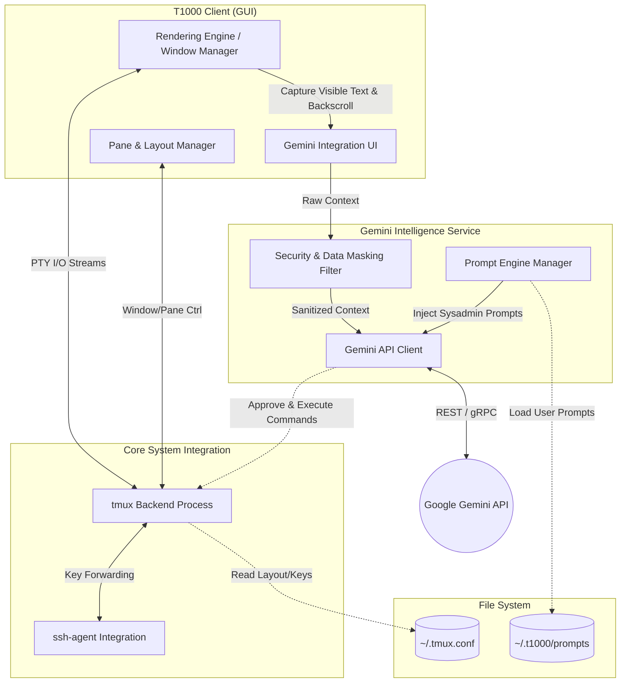

# T1000 System Architecture

This document outlines the high-level architecture and core components of the T1000 terminal emulator.

## 1. High-Level Architecture Diagram

## 2. Core Components Description

### 2.1 T1000 Client (GUI)

- **Rendering Engine**: Responsible for high-performance drawing of standard terminal content. Targets full VT100/VT220/xterm compatibility including: 24-bit TrueColor and 256-color SGR, text attributes (bold, italic, underline, reverse, blink, strikethrough), alternate screen buffer (`smcup`/`rmcup`), cursor save/restore (`DECSC`/`DECRC`), DEC scroll regions, DEC line-drawing character set, tab stops, insert mode, bracketed paste mode, mouse event forwarding, device status reports (DSR/CPR/DA), OSC window titles, and a scrollback buffer of at least 10,000 lines. Rendering uses GTK4 `TextView` with Pango markup for attribute-rich text display. Inspired by the correctness model of Alacritty and xterm.
- **Pane & Layout Manager**: Handles Terminator-style window splitting (tiling). Maps T1000's UI splits directly to under-the-hood `tmux` panes.
- **Gemini Integration UI**: Handles the presentation of the AI. When the Gemini hotkey is pressed, this module scrapes the active pane's buffer and spins up an adjacent pane or overlay to interact with the AI.

### 2.2 Core System Integration

- **tmux Backend Process**: T1000 acts as a heavily integrated frontend for `tmux`. It does not invent its own PTY management; rather, it attaches to an underlying `tmux` server. This guarantees session persistence and backward compatibility with `.tmux.conf` right out of the box.
- **ssh-agent Integration**: Ensures smooth authentication and key management when connecting to external fleets, persisting auth contexts securely across detached sessions.

### 2.3 Gemini Intelligence Service

- **Security & Data Masking Filter**: A crucial privacy layer. Scrapes terminal buffers for recognizable patterns of sensitive data (e.g., AWS keys, standard password prompts, PII) and masks them *before* any data is transmitted to the cloud.
- **Prompt Engine Manager**: Handles the lifecycle of AI system prompts. It initializes the LLM with the persona of an "expert sysadmin and security expert." It actively monitors `~/.t1000/prompts` to load community or user-defined custom prompts.
- **Gemini API Client**: The network layer connecting the local client to the Google Cloud / AI endpoint. This component translates the prompt + context into an API payload, streams the response back to the GUI, and handles the mechanism that allows Gemini to execute approved commands directly in the `tmux` pane.

## 3. Data Flow Example: Troubleshooting an Error

1. The user encounters a system daemon failure inside a pane.
2. The user presses the global **Gemini Hotkey**.
3. The **GeminiUI** queries the **Render** engine for the last N lines of visible text and scrollback.
4. The raw text is passed to the **Security Filter** to ensure no secrets are leaked.
5. The **Prompt Engine** formats the request, applying the "expert troubleshooter" persona.
6. The **API Client** sends the package to the **Google Gemini API**.
7. Gemini returns root-cause analysis and a remediation script.
8. If the user clicks "Run Fix", the **API Client** issues a command injection securely into the active **Tmux** backend pane.
